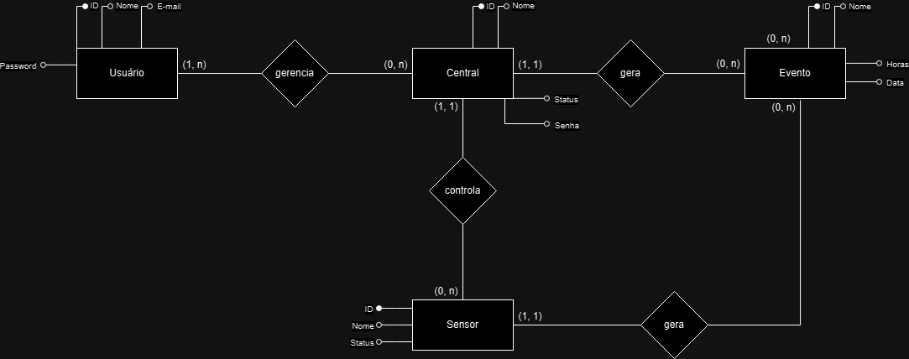
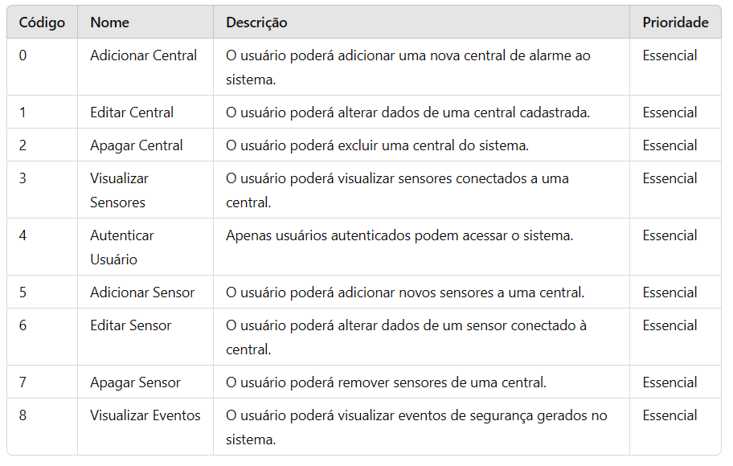
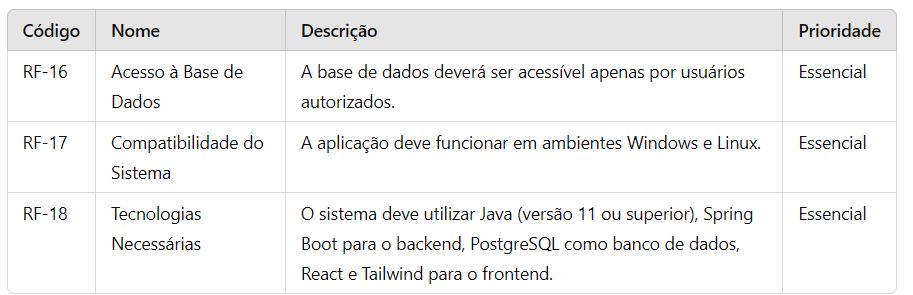

<h1>
    <p style="font-size: 15px;">
        Aluno: Davi Ribeiro de Almeida - 21.2.8018
    </p>
</h1>

## Descrição do projeto
Este projeto visa o desenvolvimento de um sistema web para monitoramento de centrais de alarme residenciais. O sistema permite que o usuário gerencie várias centrais, cada uma controlando múltiplos sensores. As centrais e sensores geram eventos de segurança registrados com data e hora. O sistema oferece uma visão centralizada para monitorar e gerenciar essas  entidades, promovendo segurança e automação residencial.

### Modelo Entidade Relacionamento


## Requisitos do sistema
### ▶ Requisitos Funcionais


### Requisitos Não Funcionais



## Tecnologias usadas
- Spring Boot
- React
- HTML
- CSS
- Tailwind

## Como rodar o projeto
```bash
    #Run Spring Boot aplication
    $ mvn clean install
    $ mvn spring-boot:run
```
Ou vá até o diretório `src/main/java/com/example/marp/MarpApplication.java` e execute o projeto em sua IDE.

```bash
    #Run React aplication
    $ cd marpfrontend
    $ npm start

```